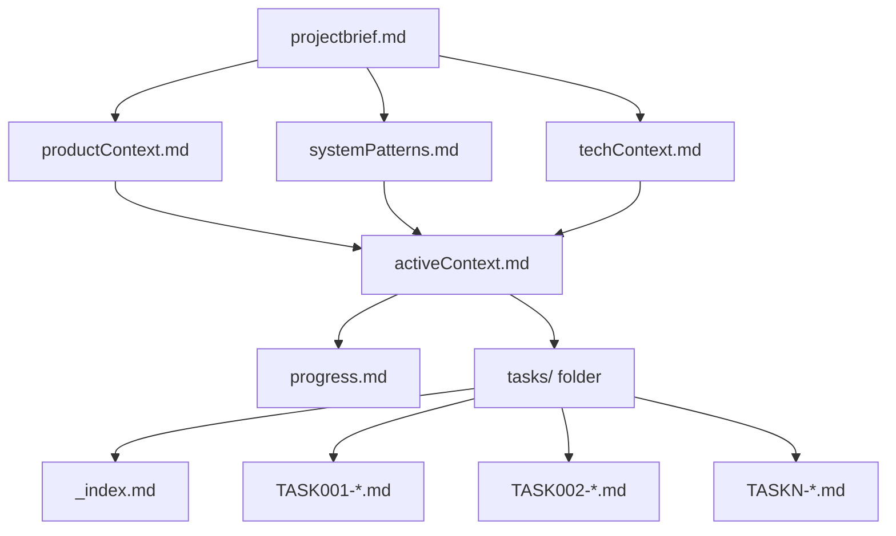
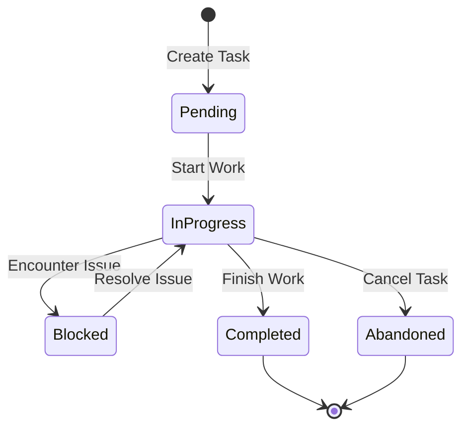

# System Patterns

**Last Updated:** 2025-06-29  
**Builds From:** projectbrief.md

## System Architecture

### Memory Bank Architecture

### Information Flow Patterns

#### Hierarchical Context Building
- **Foundation Layer**: projectbrief.md establishes core requirements
- **Context Layer**: productContext.md, systemPatterns.md, techContext.md build specific contexts
- **Active Layer**: activeContext.md synthesizes current state from context layers
- **Tracking Layer**: progress.md and tasks/ folder track implementation status

#### Dependency Management
- Each file explicitly declares its dependencies via "Builds From" metadata
- Changes cascade down the hierarchy (foundation changes affect all dependent files)
- Updates flow upward (implementation discoveries update context files)

## Key Technical Decisions

### File Organization Strategy
- **Markdown Format**: Universal readability, version control friendly, tool agnostic
- **Flat Structure**: All core files in single directory for easy navigation
- **Hierarchical Naming**: Clear dependency relationships through file organization
- **Metadata Headers**: Consistent tracking of updates and dependencies

### Documentation Patterns

#### Structured Templates
Each file type follows a consistent structure:
- **Header**: Metadata (last updated, dependencies)
- **Core Content**: Primary information organized by logical sections
- **Cross-References**: Links to related files and external resources
- **Maintenance Notes**: Guidelines for keeping content current

#### Progressive Disclosure
- **Summary First**: Key information at the top of each file
- **Detail Expansion**: Deeper information in subsequent sections
- **Context Linking**: References to related information in other files
- **External Integration**: Links to code, documentation, and resources

### Task Management Patterns

#### Task Lifecycle

#### Task Identification
- **Unique IDs**: Sequential numbering (TASK001, TASK002, etc.)
- **Descriptive Names**: Clear, action-oriented task descriptions
- **Status Tracking**: Explicit status management with timestamps
- **Progress Granularity**: Subtask breakdown for complex work

## Design Patterns in Use

### Observer Pattern (Documentation Updates)
- Changes in one file trigger review of dependent files
- Automatic cascade of updates through the hierarchy
- Event-driven maintenance of cross-references

### Template Method Pattern (File Structures)
- Consistent structure across all Memory Bank files
- Standardized sections with customizable content
- Inheritance of common patterns with specific implementations

### Strategy Pattern (Context Building)
- Different strategies for different types of context (product, system, tech)
- Pluggable context providers based on project needs
- Flexible adaptation to various project types

### Command Pattern (Task Management)
- Each task represents a discrete command with clear inputs/outputs
- Undo capability through detailed progress tracking
- Batch operations through task grouping

## Component Relationships

### Core Components

#### Memory Bank Core
- **Purpose**: Maintain project context across AI memory resets
- **Responsibilities**: Store, organize, and provide access to project knowledge
- **Interfaces**: File system, markdown readers, development tools
- **Dependencies**: None (foundational component)

#### Task Management System
- **Purpose**: Track project work and progress
- **Responsibilities**: Task creation, status tracking, progress reporting
- **Interfaces**: Memory Bank Core, development workflows
- **Dependencies**: Memory Bank Core for context

#### Context Synthesis Engine
- **Purpose**: Combine multiple context sources into actionable understanding
- **Responsibilities**: Read multiple files, synthesize current state, identify next actions
- **Interfaces**: All Memory Bank files, AI processing systems
- **Dependencies**: All Memory Bank components

### Integration Patterns

#### Development Tool Integration
- **Version Control**: All files are version controlled with the project
- **IDE Integration**: Files are readable and editable in any text editor
- **Build Process**: Documentation can be included in build artifacts
- **CI/CD Integration**: Memory Bank validation can be part of automated checks

#### AI Workflow Integration
- **Session Initialization**: AI reads Memory Bank to understand context
- **Work Execution**: AI updates Memory Bank as work progresses
- **Session Termination**: AI ensures all context is preserved
- **Cross-Session Continuity**: Next AI session has complete context

## Scalability Patterns

### Horizontal Scaling
- **Additional Context Files**: Create specialized files for complex domains
- **Subdirectory Organization**: Organize related files in subdirectories
- **External References**: Link to external documentation and resources
- **Modular Structure**: Independent modules that can be combined

### Vertical Scaling
- **Detail Levels**: Multiple levels of detail within each file
- **Progressive Enhancement**: Start simple, add complexity as needed
- **Lazy Loading**: Load detailed context only when needed
- **Caching Strategies**: Cache frequently accessed information

## Error Handling Patterns

### Graceful Degradation
- **Missing Files**: System works with partial Memory Bank
- **Corrupted Content**: Clear error messages and recovery suggestions
- **Inconsistent State**: Validation and repair mechanisms
- **Version Conflicts**: Merge strategies for concurrent updates

### Recovery Mechanisms
- **Backup Strategies**: Regular snapshots of Memory Bank state
- **Rollback Capability**: Ability to revert to previous known good state
- **Repair Tools**: Automated detection and fixing of common issues
- **Manual Override**: Human intervention for complex problems

## Performance Patterns

### Optimization Strategies
- **Lazy Loading**: Load files only when needed
- **Caching**: Cache parsed content for repeated access
- **Incremental Updates**: Update only changed sections
- **Batch Operations**: Group related updates together

### Resource Management
- **Memory Usage**: Efficient storage and retrieval of context
- **File I/O**: Minimize disk access through intelligent caching
- **Processing Time**: Fast context synthesis for immediate AI productivity
- **Storage Space**: Compact representation without losing information

## Security Patterns

### Access Control
- **File Permissions**: Standard file system security
- **Content Sensitivity**: Guidelines for handling sensitive information
- **Version Control**: Secure storage in version control systems
- **Audit Trail**: Track all changes to Memory Bank content

### Data Protection
- **Sensitive Information**: Patterns for handling confidential data
- **External References**: Secure linking to external resources
- **Backup Security**: Secure backup and recovery procedures
- **Compliance**: Adherence to relevant data protection regulations
